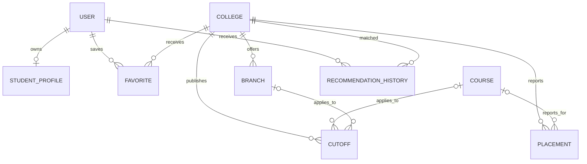

# ER diagram

```mermaid
erDiagram
 USER ||--o| STUDENT_PROFILE : owns
 USER ||--o{ FAVORITE : saves
 COLLEGE ||--o{ FAVORITE : receives
 COLLEGE ||--o{ BRANCH : offers
 COLLEGE ||--o{ CUTOFF : publishes
 COURSE o|--o{ CUTOFF : applies_to
 BRANCH o|--o{ CUTOFF : applies_to
 COLLEGE ||--o{ PLACEMENT : reports
 COURSE o|--o{ PLACEMENT : reports_for
 USER ||--o{ RECOMMENDATION_HISTORY : receives
 COLLEGE ||--o{ RECOMMENDATION_HISTORY : matched
```
