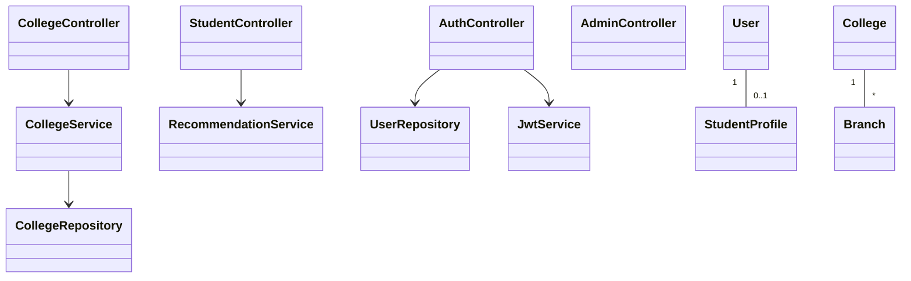

# UML overview

```mermaid
classDiagram
 class AuthController
 class CollegeController
 class StudentController
 class AdminController
 class CollegeService
 class RecommendationService
 class CollegeRepository
 class UserRepository
 class College
 class StudentProfile
 class User
 AuthController --> UserRepository
 AuthController --> JwtService
 CollegeController --> CollegeService
 CollegeService --> CollegeRepository
 StudentController --> RecommendationService
 User "1" -- "0..1" StudentProfile
 College "1" -- "*" Branch
```
